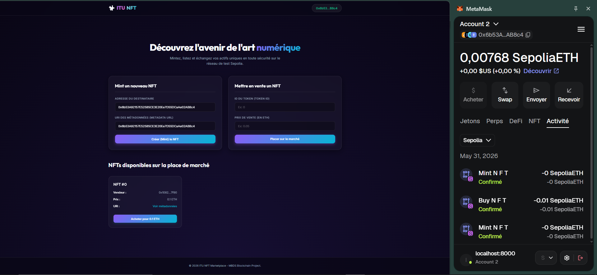
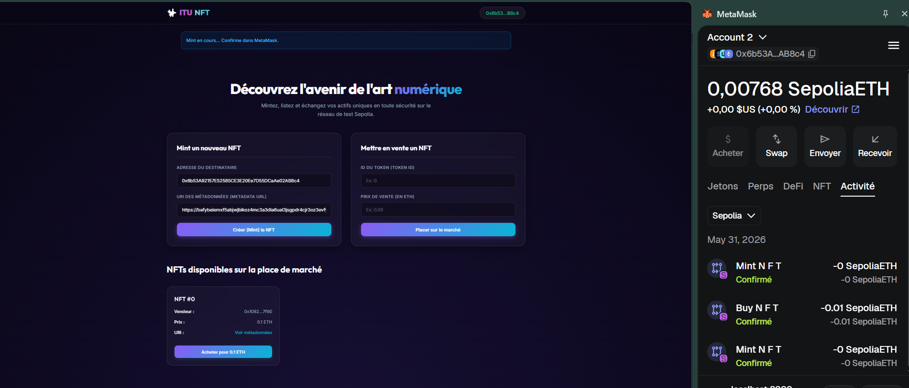
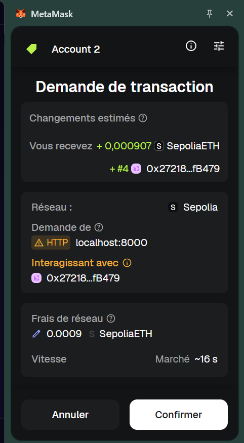
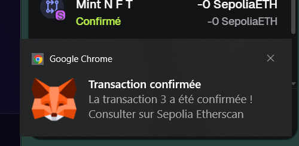
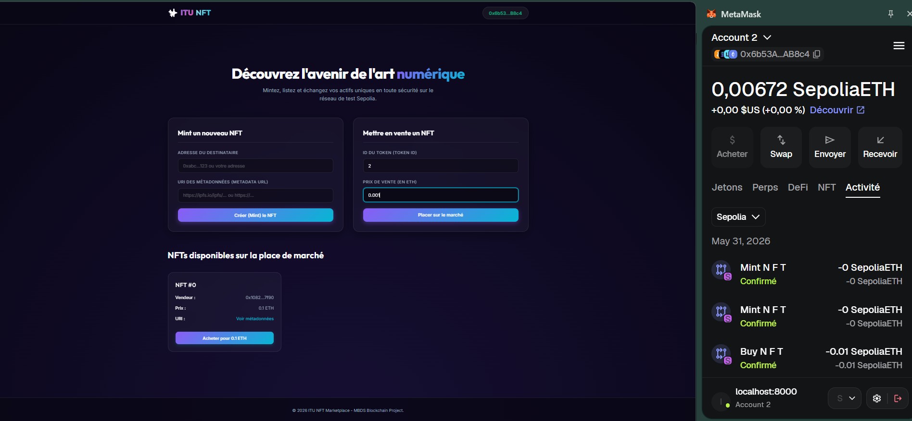
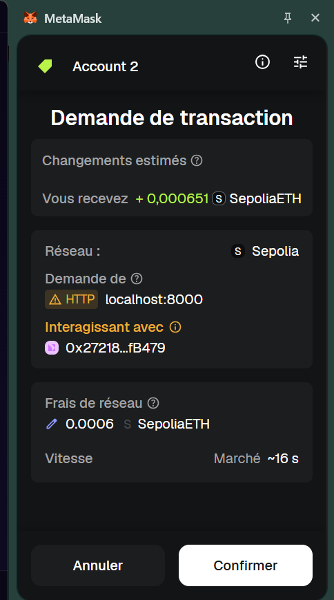
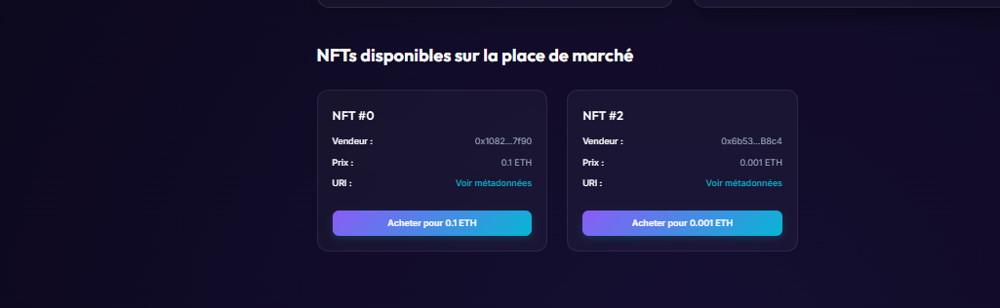
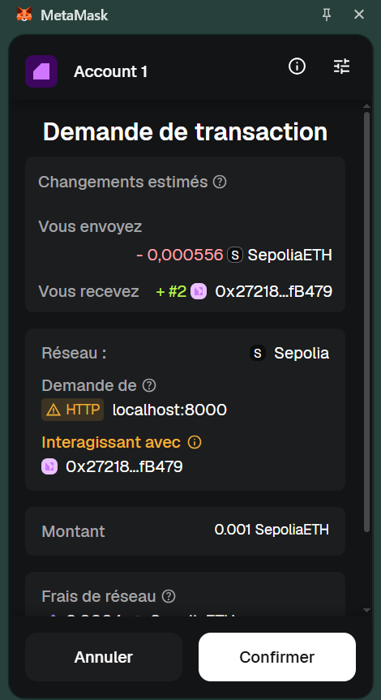
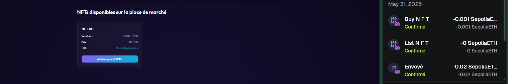

# ITU NFT Marketplace - Projet Blockchain

## Description
Une plateforme décentralisée (dApp) premium permettant de créer (minter), lister et acheter des NFTs (ERC-721) sur le réseau de test Sepolia. 

**Adresse du Contrat (Sepolia) :** `0x27218831694dd6e604Ec557A427B8768896fB479`  
[Voir sur Etherscan](https://sepolia.etherscan.io/address/0x27218831694dd6e604Ec557A427B8768896fB479)


## Architecture et Logique Métier

### Smart Contract (NFTMarketplace.sol)
- **Héritage** : Utilise les standards éprouvés d'OpenZeppelin (ERC721URIStorage et Ownable).
- **Logique Métier Correcte** : Le contrat gère de manière sécurisée tout le cycle de vie du NFT : Création (Mint), Mise en vente (Listing), Annulation, et Achat de gré à gré de manière décentralisée.
- **Structure de Données** : Utilisation optimale d'un mapping pour stocker l'état des ventes (struct Listing contenant le prix, le vendeur, et le statut actif).

### Bonnes Pratiques Solidity Appliquées
- **Pattern CEI (Checks-Effects-Interactions)** :
  - Rigidement appliqué, particulièrement dans la fonction buyNFT(uint256) :
    - Checks : Vérifications strictes (statut active de la vente, montant msg.value suffisant via require).
    - Effects : Mise à jour de l'état interne (listings[tokenId].active = false) puis transfert du NFT (_transfer).
    - Interactions : Envoi des fonds au vendeur en toute dernière étape (payable(listing.seller).call{value: msg.value}("")) pour prévenir les attaques de type Reentrancy.
- **Gestion des Erreurs (Require avec messages)** : Validation rigoureuse des conditions d'exécution à l'aide de require("Message explicite") (ex: "Prix insuffisant", "Vous n'etes pas le proprietaire").
- **Modifiers** : Modifiers de contrôle d'accès natifs (onlyOwner d'OpenZeppelin).
- **Événements (Events)** : Déclaration et émission d'événements indexés (NFTMinted, NFTListed, NFTSold) pour une mise à jour efficace de l'interface utilisateur (UI).

## Frontend (dApp Reactivité)

- **Connexion MetaMask** : Gestion robuste du cycle de connexion. Détection automatique du fournisseur (window.ethereum) et protection de l'UX imposant le réseau Sepolia (ChainID: 11155111).
- **Lecture / Écriture au Contrat** :
  - Lecture (View) : Appels asynchrones (totalSupply(), getListing()) combinés pour afficher la marketplace dynamique des NFTs disponibles sans frais de Gas.
  - Écriture (Transactions) : Intégration fine d'ethers.js (v6) pour signer et envoyer des transactions (mintNFT, buyNFT, listNFT).
- **UX Lisible et Moderne** : Interface soignée utilisant une approche Glassmorphism. Formulaires intuitifs (Validation Native HTML5) et cartes NFT (Images, Metadata) avec des messages d'aide en temps-réel (Succès/Erreur/Info).
- **Gestion d'Erreurs Frontend** : Parsing avancé des erreurs blockchain dans app.js (formaterErreur(err)). Les erreurs cryptiques (Custom Errors, Action Rejected, Gas Estimation, ERC721NonexistentToken) sont attrapées et traduites en français lisible pour l'utilisateur final.

## Comment démarrer l'application

### Prérequis
- MetaMask (extension de navigateur) avec le réseau de test Sepolia actif.
- Jetons de test (Sepolia ETH) : [Cloud Google Faucet](https://cloud.google.com/application/web3/faucet/ethereum/sepolia).
- Python (ou un autre serveur local simple) pour servir l'application.

### Démarrage local
L'application web est construite en HTML, CSS et JavaScript pur (sans Node.js ou outil de build complexe nécessaire pour la démarrer).

1. Clonez ce dépôt.
2. Ouvrez un terminal et placez-vous dans le dossier `frontend/` du projet :
   ```bash
   cd frontend
   ```
3. Lancez un serveur web local avec Python :
   ```bash
   python -m http.server 8000
   ```
   *(Alternative : utilisez Live Server dans VSCode, ou `npx serve` si vous avez Node.js).*
4. Ouvrez votre navigateur et accédez à l'adresse : **http://localhost:8000**

### Scénario de Test Recommandé (avec Captures d'écran)

1. **Connexion** : Cliquez sur "Connecter MetaMask" (vérifiez d'être sur le réseau Sepolia).

2. **Créer un NFT (Mint, Compte 1)** : Dans la section Mint, entrez votre propre adresse MetaMask et une URL de métadonnées valide (ex: https://ipfs.io/ipfs/QmTest), puis validez la transaction. Prenez note du Token ID renvoyé (ex: 0).





3. **Mise en vente (Compte 1)** : Dans la section de mise en vente, entrez l'ID de votre token et fixez son prix (ex: 0.01 ETH). Validez la transaction.



4. **Achat (Compte 2) et Galerie** : Ouvrez MetaMask, basculez vers un deuxième compte et rafraîchissez la page. Vous verrez les NFTs disponibles dans la galerie en bas de page pour procéder à l'achat.




5. **Vérifications** : Consultez votre contrat sur Sepolia Etherscan pour prouver que les transactions ont bien été exécutées (onglets Transactions et Internal Txns).